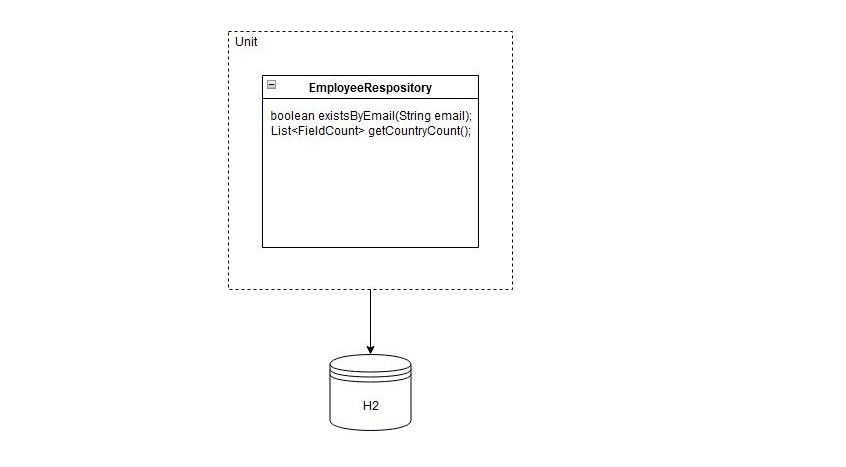
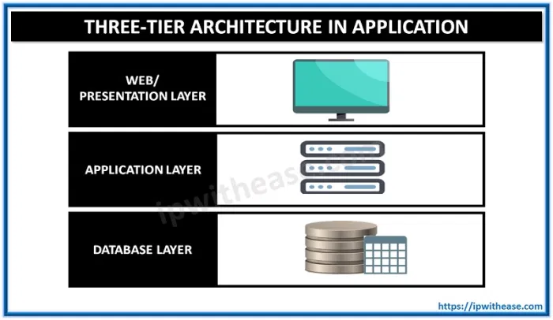
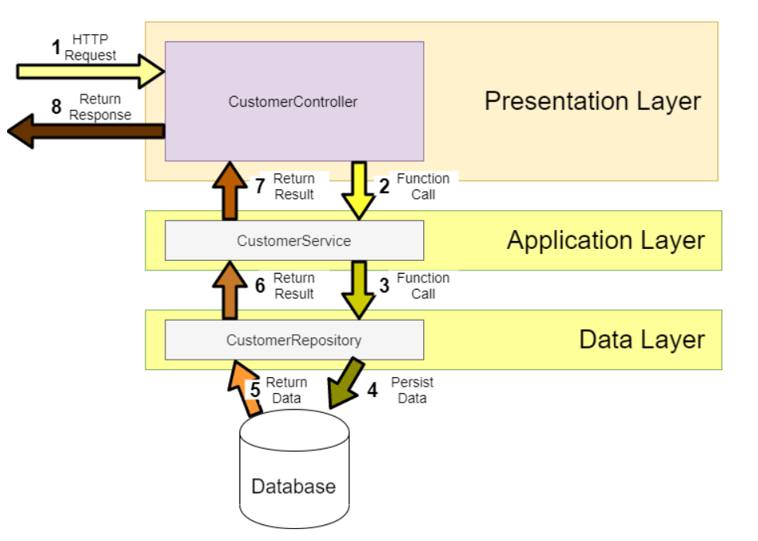
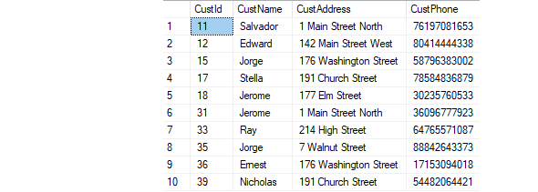

# REST CRUD API Tutorials - Creating a CRUD application using REST API

## Version 5 - Unit Testing

`Introduction`

Unit test refers to the test of the most basic parts of an app -> A Unit. For REST application, we create test cases starting from Repository layer, then Service layer, then Controller where the test focus on integrating different layers of the application.

`Dependencies for testing`

    <dependency>
        <groupId>junit</groupId>
        <artifactId>junit</artifactId>
        <scope>test</scope>
        <exclusions>
            <exclusion>
                <groupId>org.hamcrest</groupId>
                <artifactId>hamcrest-core</artifactId>
            </exclusion>
        </exclusions>
    </dependency>
    
    <dependency>
        <groupId>org.hamcrest</groupId>
        <artifactId>hamcrest-library</artifactId>
        <scope>test</scope>
    </dependency>   

also add dependency for h2:
    
    <dependency>
        <groupId>com.h2database</groupId>
        <artifactId>h2</artifactId>
        <scope>test</scope>
    </dependency>

### Unit Test - Repository

`Diagram`

- In Repository, we dont need to test build-in methods of JPA. Only test your custom methods [(Explanation)](https://youtu.be/Geq60OVyBPg?t=2422)

- Since we dont have one, lets create one [(using @Query)](https://stackoverflow.com/questions/58453768/variables-in-spring-data-jpa-native-query)

- This query will count number of country in employee table

- The result will have custom fields [(using projection)](https://stackoverflow.com/questions/46083329/no-converter-found-capable-of-converting-from-type-to-type) 

Run http to test:  

Number of each country

    http://localhost:9090/crud-api/employees/count/country

Number of a country

    http://localhost:9090/crud-api/employees/count/singapore

`H2 database`

To test repository, we can run the query against H2 database simply we dont want to store the data during testing. This can be easily done by copy-paste our main application.properties into the test folder and change the db url from mysql to h2. Schema and data will be loaded from the main resources

Now lets create a unit test for this!

`Create test case`

Simply right-click on the repo file -> new -> Junit. This will automatically generate test method. We will implement our test cases. 

**********************************************************************

## Version 4 - Global exception - @ControllerAdvice

`Intro`

    During the software development process, it is inevitable to handle all kinds of exceptions. For me, at least half of the time is spent dealing with all kinds of exceptions, so there will be a lot of try {...} catch {...} finally {...} code blocks in the code, which not only has a lot of redundant code, but also affects the readability of the code.

`So what is it?`

    Spring consider exception handling a cross-cutting concern, thus it allows you to handle exceptions separately from the rest of your code. This approach truly does work great with Spring!

    Used for global error handling in the Spring MVC application.It also has full control over the body of the response and the status code.

`Types?`

There are 2 types:

1. Custom exception - where u throw yourself if it meets your condition and use GlobalExceptionHandler to handle [HERE](https://stackoverflow.com/questions/67090406/throw-custom-exception-with-spring-data-rest)

        
2. Global exception - where it throwas itself and u handle it using GlobalExceptionHandler

`Benefits?`

    No cluttering of your code surrounding with try-catch blocks
    u can have more meaningful error message

Previously we use try catch to handle exception. Now lets refactor our code by removing all try-catch blocks and use global exception handler!

`Maven packaging issues`

If you have issue packaging to jar, click [HERE](https://stackoverflow.com/questions/35394885/lombok-not-compiling-in-maven)

`Objectives`

1. Create global exception handler to handle expected errorr
2. Create custom exception handler to handle our own error
3. Create 1 generic error to handle other unexpected errors

### ******************************************* ###

/////////////////////////////////////////////////////////////////////////
************************************************************************

## Version 3 - CRUD operations

This were the main function is. We will be doing CRUD operations - create, read, update and delete. We will also apply try-catch for expected errors. Before this let us understand the architecture:

`3 tier architecture`

`Layered Architecture`  

### Rest Controller

- Implement controller to receive requests and use ResponseEntity() to return different status codes
- Implement validation such as min character, unique value, 
- Add validation dependency - javax-validation [HERE](https://www.baeldung.com/javax-validation)
- Validate using @Valid in controller
- Retrieve validation message [HERE](https://stackoverflow.com/questions/2751603/how-to-get-error-text-in-controller-from-bindingresult)
- Diff btwn javax.persistence & javax.validation and how to handle error from each validation [HERE](https://reflectoring.io/bean-validation-with-spring-boot/)
- Create mock data from [HERE](https://www.mockaroo.com/) 

### Patch method

- How to map random fields [HERE](https://newbedev.com/spring-rest-partial-update-with-patch-method) 

- How to validate patch method using ValidatorFactory
[HERE](https://stackoverflow.com/questions/56139024/how-to-automatically-add-bean-validation-when-partially-updating-patch-spring-bo) 

- Know that entity having camelCase will mapped into db into under_score eg:

    In Entity: birthDate -> birth_date in Database

- Use exception to throw validation error by means of try-catch

- Implement more fields in Employee to learn pagination

- Structuring Your Code [HERE](https://docs.spring.io/spring-boot/docs/current/reference/html/using.html#using.structuring-your-code)  

       
This branch we have made a few bad practics:
- How messy the response object is,
- Messy try-catch blocks
- We didnt handle all related exception, and it is hard to handle all exception as the code will get cluttered

We also assume that this is web-service where user can enter any field and value so a lot of validation is needed. Know that most of the time it will be web application so most validation will be done in front-end. Something to take note of.

Next lesson we will use @ControllerAdvice to handle ALL exception. This will result in cleaner and manageable code. See you next lesson!

/////////////////////////////////////////////////////////////////////////
************************************************************************

## Version 2 - Customize json property

The Jackson JSON toolkit contains a set of Java annotations which you can use to influence how JSON is read into objects, or what JSON is generated from the objects. Click  [HERE](http://tutorials.jenkov.com/java-json/jackson-annotations.html) for more information.

 
### Arrange your order of json properties

Currently the id is at the bottom. we can bring this up by adding this at class level:  

    @JsonPropertyOrder({"firstName","lastName"})
    
From this example, firstName will be at the most top followed by lastName

### Hide json property

You can hide certain property of json. let us hide lastName by this annotation in entity:

    @JsonIgnore
    private String lastName;

### Creation timestamp

Marks a property as the creation timestamp of the containing entity. The property value will be set to the current VM date exactly once when saving the owning entity for the first time.

    @CreationTimestamp
    private Date createdAt;

### Rename json property

You can rename your json property name instead of using the vdefault value based on variable name

    @JsonProperty("MyAwesomeFirstName")
    private String firstName;

///////////////////////////////////////////////////////////////////////////
**************************************************************************

## Version 1 - Create DB

### Diagram flow

    Database
        |
    Repository -> Model (Entity)
        |
    Service - > Exception Handler
        |
    Controller (Handle request from external)

### Step 1 - Maven dependencies

Jpa - Maps Java objects to relational database tables
Rest repositories
MySql connector - To use MySql for database
Lombok - boilerplate reduction
Devtool - Auto restart on any changes
Validation - To validate user input 
Hibernate Validator - Reference implementation of the validation API.
H2 - For testing custom query
Web - Develop web applications using Tomcat as embedded server. Without this, the app will shutdown once everything is done.
Apache Commons Lang -  host of helper utilities for the java

### Step 2 - Run DB server

We will create DB without having to manually create from RDBMS by utilising Spring JPA. Our table will look something like this:

We will be using MySql for database creation and will be using Docker to run MySql. Lets create an instance of MySql Docker image:

    docker run --detach --env MYSQL_ROOT_PASSWORD=root --env MYSQL_DATABASE=mydb --env MYSQL_PASSWORD=root --env MYSQL_USER=admin --name localhost --publish 3306:3306 mysql:8.0

    docker run --name postgres-tutorial -e POSTGRES_PASSWORD=password -d -p 5432:5432 postgres

### Step 3 - Create entity

Entities in JPA are nothing but POJOs representing data that can be persisted to the database. An entity represents a table stored in a database. Every instance of an entity represents a row in the table. This will be in Employee.java

### Step 4 - Configure datasource

This is to configure how you connect to database. This configuration can be defined in application.properties. Make the the properties is consistent with the variables defined during creation of database server.

  server.port=9090

  spring.datasource.url=jdbc:mysql://localhost:3306/mydb?useLegacyDatetimeCode=false&serverTimezone=UTC
  spring.datasource.password=root
  spring.datasource.username=admin

  spring.jpa.properties.hibernate.dialect=org.hibernate.dialect.MySQL8Dialect
  spring.jpa.properties.hibernate.format.sql=true
  spring.jpa.hibernate.ddl-auto=create
  spring.jpa.show-sql=true
  spring.sql.init.mode=always
  server.servlet.context-path=/crud-api

  spring.jpa.defer-datasource-initialization: true

### Step 5 - Prepopulate data

We can add values in our table in data.sql in resources folder. This values will be added when Spring starts. In certain scenario you might not able able to populate thru this approach so you have to manually add values thru test cases. 

This test case will be created under repository test folder, for the sake of Project Structure Best Practices. But first we need to create repository, then generate test case through it, run Spring, then run this test.

### Step 6 - Start Spring!

Start Spring. Ensure there is no error,

### Step 7 - Verify database

Once Spring starts, let's check our database (thru docker container) to verify if table is created and data added. Make sure the parameters entered is consistent with the variables used during docker creation.

`Run mysql in cli using docker`  

    docker exec -it localhost bash

`Connect to mysql`  

    mysql -u admin -proot;

`Test`  

    use mydb;  
    show tables;
    desc employee;  
    select * from employee;  

`Stop & remove all running proceses`  

    docker rm $(docker ps -a -q) -f

### Step 8 - Verify in Postman / Web browser

  Let's make a controller and sent request to view our pre-populated data.